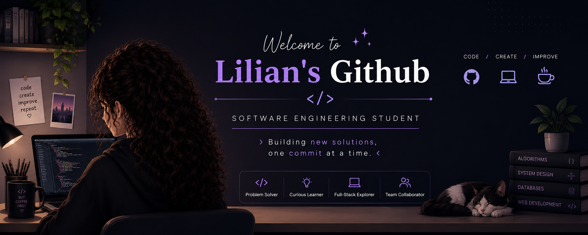

---
Hi, I'm Lilian, a Software Engineering student specializing in Web and Mobile Application Development (Graduating 2027). I have experience in developing Web Application with JavaScript/React and now am actively looking for tech internships.

📍 Jakarta, Indonesia.

**Languages spoken:** English (Native) · Indonesian (Conversational)

---
## 💻 Tech Stack

**Programming**  
     

**Frameworks & Libraries**  
  

**Databases & Infrastructure**  
    

## 📊 GitHub Stats
<table border="0">
  <tr>
    <td>
      
    </td>
    <td>
      
    </td>
  </tr>
</table>

---
## 📂 Featured Projects
### [Nosy Neighbor — Real-Time Multiplayer Strategy Game](https://github.com/Lili-ann/Nosy-Neighbor-Real-Time-Multiplayer-Strategy-Game)
 Nosy Neighbor is a real-time multiplayer web game where players interact through a live
React frontend connected to a Flask-SocketIO backend. The project uses Redis to store live game state,
RabbitMQ for audit logging, and Docker Compose to run the full system across frontend, backend,
database, message broker, and worker services.`JavaScript` 
[Live Demo](link)

### [Python Story Game](https://github.com/Lili-ann/Python-Story-game)
Eye Scare is a text-based interactive horror story game originally built in Python as a first-year university group project. It's now also playable in the browser as a web app. `Python`
[Live Demo](https://python-story-game--lilian0417.replit.app).

